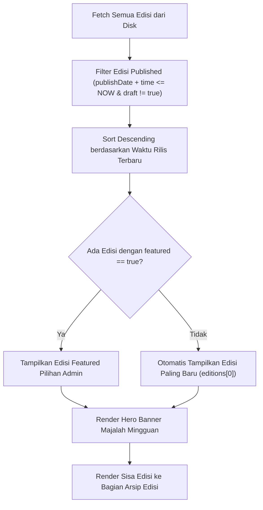
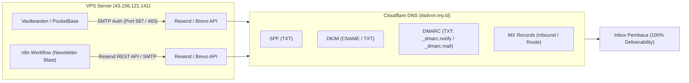

# 📋 Dokumen Perencanaan Teknis & Implementasi Portfolio Web v3

Dokumen ini adalah rencana kerja komprehensif untuk pengembangan fitur **v3** yang mencakup:
1. **Sistem Edisi Mingguan Dinamis (Auto-Update / Nimpa & Persistent Stay)**.
2. **Arsitektur & Konfigurasi Email Domain (`notify.itsdvvn.my.id` & `mail.itsdvvn.my.id`)**.

---

## 🎯 Bagian 1: Logika Edisi Mingguan (Auto-Update & Persistent Stay)

### 1.1 Masalah Saat Ini & Tujuan
- **Tujuan**: Memastikan banner Majalah Mingguan di halaman `/writings` selalu aktif secara otomatis:
  - Jika ada edisi baru yang mencapai jadwal terbit (`publishDate` + `publishTime` $\le$ sekarang), edisi tersebut otomatis **menimpa (*auto-replace*)** edisi lama di banner utama.
  - Jika belum ada edisi baru yang terbit (misal minggu ini belum rilis edisi baru), edisi terakhir yang telah terbit **akan tetap tampil (*stay persistent*)**.
  - Edisi-edisi lama secara otomatis masuk ke daftar **Arsip Edisi Sebelumnya**.

### 1.2 Algoritma Penentuan Active Edition


### 1.3 File yang Akan Dimodifikasi:
- `src/pages/writings/index.astro`:
  - Penyesuaian `publishedEditions`, `activeEdition`, `coverStoryArticle`, dan pemisahan `archiveEditions`.
- `src/pages/writings/[slug].astro`:
  - Penyesuaian navigasi edisi terkait dan breadcrumb.

---

## ✉️ Bagian 2: Arsitektur Email Domain (`notify.*` & `mail.*`)

### 2.1 Alokasi Subdomain & Fungsinya
1. **`notify.itsdvvn.my.id` (Transactional / No-Reply)**:
   - **Tujuan**: Notifikasi sistem, verifikasi email, dan reset password.
   - **Sender**: `no-reply@notify.itsdvvn.my.id` atau `system@notify.itsdvvn.my.id`.
   - **Consumer**: Vaultwarden (Bitwarden Server), PocketBase, CMS Security Alerts.
2. **`mail.itsdvvn.my.id` (Marketing / Newsletter)**:
   - **Tujuan**: Distribusi newsletter mingguan, rilis artikel baru, dan update portofolio.
   - **Sender**: `yudi@mail.itsdvvn.my.id` atau `newsletter@mail.itsdvvn.my.id`.
   - **Consumer**: Workflow otomasi **n8n** di VPS, webhook artikel rilis.

---

### 2.2 Arsitektur Alur Pengiriman Email



---

### 2.3 Rencana Konfigurasi DNS di Cloudflare

Untuk memastikan email terkirim langsung ke **Inbox** (bukan folder Spam):

#### A. Untuk Subdomain `notify.itsdvvn.my.id`:
1. **SPF Record**:
   - `Type`: `TXT` | `Name`: `notify` | `Value`: `v=spf1 include:resend.com ~all` (atau include service pilihan).
2. **DKIM Record**:
   - `Type`: `TXT` / `CNAME` | `Name`: `resend._domainkey.notify` | `Value`: *[Generated DKIM Key]*
3. **DMARC Record**:
   - `Type`: `TXT` | `Name`: `_dmarc.notify` | `Value`: `v=DMARC1; p=none; rua=mailto:swahyuinfo@gmail.com`

#### B. Untuk Subdomain `mail.itsdvvn.my.id`:
1. **SPF Record**:
   - `Type`: `TXT` | `Name`: `mail` | `Value`: `v=spf1 include:resend.com ~all`
2. **DKIM Record**:
   - `Type`: `TXT` / `CNAME` | `Name`: `resend._domainkey.mail` | `Value`: *[Generated DKIM Key]*
3. **DMARC Record**:
   - `Type`: `TXT` | `Name`: `_dmarc.mail` | `Value`: `v=DMARC1; p=none; rua=mailto:swahyuinfo@gmail.com`

---

### 2.4 Integrasi Layanan VPS

1. **Konfigurasi Vaultwarden (`notify.itsdvvn.my.id`)**:
   Menambahkan environment variable pada `docker-compose` Vaultwarden:
   ```yaml
   SMTP_HOST: smtp.resend.com
   SMTP_FROM: no-reply@notify.itsdvvn.my.id
   SMTP_PORT: 587
   SMTP_SECURITY: starttls
   SMTP_USERNAME: resend
   SMTP_PASSWORD: <API_KEY>
   ```

2. **Konfigurasi n8n (`mail.itsdvvn.my.id`)**:
   - Menyiapkan node HTTP Request / Send Email di n8n untuk mentrigger newsletter secara otomatis setiap hari Minggu jam 08:00 WIB saat edisi majalah baru dirilis.

---

## 📅 Rencana Tahapan Eksekusi (Checklist):

- [ ] **Tahap 1**: Implementasi & Uji Coba Logika Edisi Mingguan Auto-Update & Persistent Stay di codebase Astro.
- [ ] **Tahap 2**: Setup Akun Service Email (Resend / Brevo) dan generate token API & verifikasi domain.
- [ ] **Tahap 3**: Input DNS Records (SPF, DKIM, DMARC) di Cloudflare Dashboard.
- [ ] **Tahap 4**: Integrasi SMTP ke Vaultwarden / PocketBase (`notify.itsdvvn.my.id`) dan uji coba pengiriman reset password.
- [ ] **Tahap 5**: Pembuatan template email newsletter dan workflow n8n (`mail.itsdvvn.my.id`).
- [ ] **Tahap 6**: Testing menyeluruh di Staging (`dev.itsdvvn.my.id`) sebelum deploy ke Production.

---

*Dokumen ini tersimpan di [`PLANNING-V3.md`](file:///Users/yudhi/Documents/yudi-portofolio-web/PLANNING-V3.md).*
