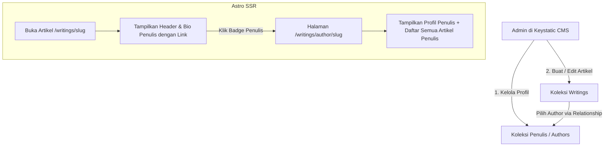

# ✍️ Planning: Fitur Profil Penulis Dinamis & Halaman Arsip Penulis (v4)

Dokumen perencanaan arsitektur dan teknis untuk **Fitur Manajemen Penulis (Dynamic Authors Profile Management)** dan **Halaman Koleksi Artikel Penulis (Author Archive & Filter Page)** pada CMS Keystatic dan Frontend Website `dvvn`.

---

## 🎯 1. Latar Belakang & Tujuan

1. **Fleksibilitas Penulis di CMS**:
   - Memungkinkan pemilik situs untuk mengelola profil penulis langsung dari Keystatic CMS (nama penulis, bio deskripsi wajib, foto avatar, serta link media sosial).
   - *Role* ditiadakan agar lebih simpel dan fokus pada identitas tulisan.
   - Mendukung multi-penulis (misal: penulis utama `dvvn`, kontributor tamu, atau alter-ego).
2. **Kustomisasi Per Artikel**:
   - Setiap artikel di Keystatic CMS dapat memilih penulis yang sesuai melalui dropdown relationship.
   - Jika tidak dipilih, sistem otomatis menggunakan penulis *Default* (dvvn / Wahyudi Setiawan).
3. **Kartu Penulis Elegan di Bagian Bawah Artikel**:
   - Menampilkan foto avatar, nama penulis, bio wajib, serta link media sosial penulis secara dinamis dan responsif (Light & Dark mode).
4. **Halaman & Filter Artikel Penulis (*Author Archive Page*)**:
   - Ketika pembaca mengklik nama / badge penulis (baik di header artikel, kartu penulis bawah, atau daftar tulisan), pembaca akan diarahkan ke halaman `/writings/author/[slug]`.
   - Halaman ini menampilkan **Header Profil Penulis** (Avatar, Nama, Bio, Media Sosial, Jumlah Tulisan) serta **Daftar Semua Artikel** yang ditulis oleh penulis tersebut.

---

## 🏗️ 2. Arsitektur Teknis & Alur Data



---

## 🛠️ 3. Rincian Komponen & File yang Dikerjakan

### A. Skema Koleksi Penulis Baru di Keystatic CMS
- **File**: [`keystatic.config.ts`](file:///d:/yudi-portofolio-web/keystatic.config.ts)
- **Koleksi**: `authors` (`src/content/authors/*`, format: `json`)
- **Fields**:
  1. `name`: `fields.slug` — Nama lengkap / nama pena penulis (Wajib).
  2. `bio`: `fields.text` (multiline, `validation: { isRequired: true }`) — Deskripsi / bio penulis (Wajib diisi).
  3. `avatar`: `fields.image` — Upload foto profil (ke `public/images/authors`).
  4. `avatarUrl`: `fields.text` — URL foto avatar dari CDN / R2 (opsional).
  5. `instagram`: `fields.text` — Username / URL Instagram.
  6. `xTwitter`: `fields.text` — Username / URL X (Twitter).
  7. `website`: `fields.text` — Tautan website pribadi / portofolio luar.
  8. `isDefault`: `fields.checkbox` — Menandai penulis ini sebagai profil default jika artikel tidak memilih penulis spesifik.

### B. Hubungan Penulis ke Artikel (Relationship Field)
- **File**: [`keystatic.config.ts`](file:///d:/yudi-portofolio-web/keystatic.config.ts) & [`src/content/config.ts`](file:///d:/yudi-portofolio-web/src/content/config.ts)
- **Pada `collections.writings`**:
  ```typescript
  author: fields.relationship({
    label: '✍️ Pilih Penulis (Author)',
    collection: 'authors',
    description: 'Pilih profil penulis untuk tulisan ini (opsional, jika kosong memakai profil default)',
  })
  ```

### C. Halaman Arsip Penulis (`/writings/author/[slug].astro`)
- **File**: `src/pages/writings/author/[slug].astro` (Halaman Baru)
- **Fitur Halaman**:
  - Menampilkan Hero Profile: Avatar besar, Nama Penulis, Bio lengkap, Media Sosial, dan Badge total artikel.
  - Menampilkan grid/list seluruh artikel (Harian & Mingguan) yang ditulis oleh penulis tersebut.
  - Navigasi kembali ke `/writings`.

### D. Handler Media File
- **File**: [`src/pages/media/[...file].ts`](file:///d:/yudi-portofolio-web/src/pages/media/%5B...file%5D.ts)
- Menambahkan direktori `public/images/authors` ke dalam kandidat pencarian file statis media.

### E. Tampilan Frontend Kartu Penulis di Artikel (`/writings/[slug]`)
- **File**: [`src/pages/writings/[slug].astro`](file:///d:/yudi-portofolio-web/src/pages/writings/%5Bslug%5D.astro)
- Nama dan avatar penulis di artikel sekarang dapat diklik (*clickable*) menuju ke `/writings/author/[slug]`.
- Menampilkan foto avatar, nama, bio wajib, dan link sosial media.

### F. Data Awal Penulis Default (Seeding)
- **File**: `src/content/authors/dvvn.json` (Profil bawaan untuk Wahyudi Setiawan / dvvn dengan bio wajib).

---

## 🧪 4. Rencana Pengujian & Verifikasi

1. **CMS Keystatic**:
   - Buka `/keystatic`, cek menu baru **"Penulis (Authors)"**.
   - Coba buat penulis baru (validasi: bio wajib diisi, tidak ada field role).
   - Buka artikel dan pilih penulis dari dropdown, lalu simpan.
2. **Halaman Artikel Publik & Klik Badge**:
   - Buka artikel di `/writings/[slug]`.
   - Klik nama/badge penulis: Sistem membuka halaman `/writings/author/[slug]`.
   - Pastikan halaman menampilkan profil penulis dan daftar semua artikel yang ditulis oleh penulis tersebut.
3. **Build & Deploy Staging**:
   - Uji `npm run build` dan deploy ke `dev.itsdvvn.my.id`.

