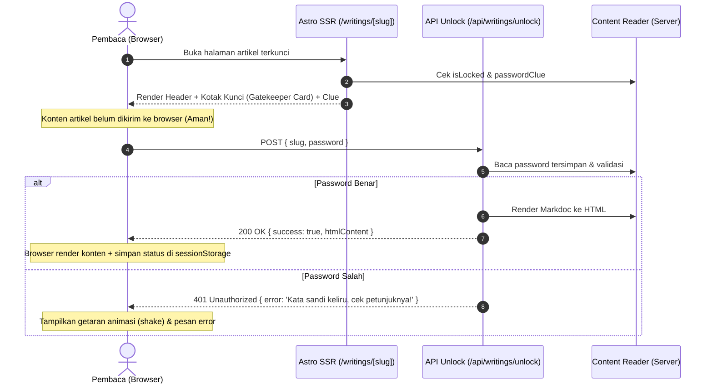

# 🔐 Planning: Fitur Kunci Artikel dengan Password & Clue (v4)

Dokumen perencanaan arsitektur dan implementasi teknis untuk **Fitur Kunci Artikel (Password-Protected Writings with Clue)** pada blog & portofolio web `dvvn`.

---

## 🎯 1. Tujuan & Konsep Fitur

1. **Privasi Konten Terpilih**: Memungkinkan admin/penulis untuk mengunci artikel tertentu (misal: tulisan personal, curhat, draf eksklusif, atau cerita khusus teman dekat) agar tidak bisa dibaca oleh publik sembarangan.
2. **Interaktivitas Berbasis Clue**: Pembaca yang ingin membuka artikel akan diberikan petunjuk (*clue*), seperti: *"makanan kesukaan"*, *"nama kucing pertama"*, atau *"tempat kita pertama ketemu"*.
3. **Aman & Tidak Bocor di HTML (*Zero Leakage SSR*)**:
   - Konten artikel yang dikunci **TIDAK dikirimkan dalam HTML awal** (tidak bisa di-inspect melalui *View Page Source* atau DevTools).
   - Konten artikel hanya akan dikirim dari server via API endpoint setelah kata sandi diverifikasi benar.

---

## 🏗️ 2. Arsitektur Teknis

---

## 🛠️ 3. Rincian Komponen & File yang Dikerjakan

### A. Skema Konten & Keystatic CMS
- **File**: [`src/content/config.ts`](file:///d:/yudi-portofolio-web/src/content/config.ts) & [`keystatic.config.ts`](file:///d:/yudi-portofolio-web/keystatic.config.ts)
- **Field Tambahan**:
  1. `isLocked`: `fields.checkbox` (Default: `false`) — Menandai apakah artikel dikunci.
  2. `password`: `fields.text` — Kata sandi pembuka artikel.
  3. `passwordClue`: `fields.text` — Petunjuk kata sandi yang ditampilkan ke pembaca (contoh: *"Makanan kesukaan"*).

### B. Endpoint API Server-Side Verification
- **File**: `src/pages/api/writings/unlock.ts` (Endpoint Baru)
- **Metode**: `POST`
- **Payload**: `{ slug: string, password: string }`
- **Logika**:
  - Membaca artikel dari `reader.collections.writings.read(slug)`.
  - Membandingkan kata sandi secara aman (case-insensitive & trim whitespace).
  - Jika cocok, mengonversi Markdoc AST menjadi HTML dan mengirimkannya ke klien bersama `readTime`.
  - Jika tidak cocok, mengembalikan respons error `401 Unauthorized`.

### C. Antarmuka Halaman Detail Artikel
- **File**: [`src/pages/writings/[slug].astro`](file:///d:/yudi-portofolio-web/src/pages/writings/%5Bslug%5D.astro)
- **Komponen Password Gatekeeper Card**:
  - Desain minimalis elegan terintegrasi *Light & Dark mode*.
  - Icon gembok animasi 🔒 ➔ 🔓.
  - Kotak Petunjuk: *"💡 Petunjuk: [makanan kesukaan]"*.
  - Input field kata sandi langsung terlihat (*plain text* `type="text"`, tanpa icon mata show/hide) agar praktis dan mudah dibaca saat mengetik.
  - Tombol aksi *"Buka Artikel"*.
  - Penyimpanan sesi di `sessionStorage` (`unlocked_[slug] = true`) agar saat pembaca merefresh halaman dalam sesi yang sama, artikel tetap terbuka tanpa perlu input ulang.

### D. Penanda Visual di Daftar Tulisan
- **File**: [`src/pages/writings/index.astro`](file:///d:/yudi-portofolio-web/src/pages/writings/index.astro) & [`src/pages/index.astro`](file:///d:/yudi-portofolio-web/src/pages/index.astro)
- Badge status `🔒 Terkunci` pada kartu artikel yang diproteksi agar pembaca mengetahui tulisan tersebut membutuhkan kata sandi.

---

## 🧪 4. Rencana Verifikasi

1. **Uji Coba di CMS Keystatic**:
   - Buat/edit artikel dengan opsi `isLocked: true`, password: `seblak`, clue: `makanan kesukaan`.
2. **Uji Coba Browser**:
   - Buka artikel: Pastikan hanya Header dan Kotak Kunci yang muncul (periksa DevTools *View Source* untuk memastikan teks tidak bocor).
   - Tes input salah: Muncul peringatan *"Kata sandi salah..."*.
   - Tes input benar: Artikel terbuka mulus dengan animasi transisi dan dapat dibaca lengkap.
3. **Deploy Staging**:
   - Push ke `develop-v4` dan deploy ke `dev.itsdvvn.my.id` untuk pengetesan online.
