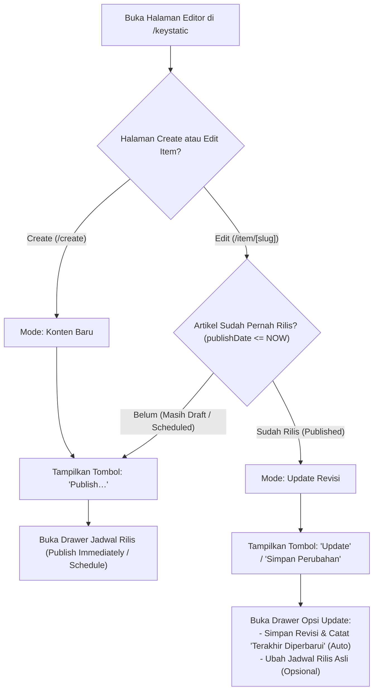

# 📋 Dokumen Perencanaan Teknis & Implementasi Portfolio Web v4

Dokumen ini adalah rencana kerja komprehensif untuk pengembangan fitur **v4** pada website `itsdvvn.my.id`, yang berfokus pada:
1. **Transformasi Showcase Portfolio (`ships`) Menjadi Halaman Detail / Studi Kasus Multimedia Interaktif (Bukan Direct Link)**.
2. **Logika & Antarmuka "Publish" vs "Update" pada Artikel (`writings`) dan CMS Keystatic**.

---

## 🎯 Bagian 1: Portfolio / Case Study Detail Page (`/ships/[slug]`)

### 1.1 Masalah Saat Ini & Solusi
- **Kondisi Sebelumnya**: Kartu portofolio di homepage dan halaman `/ships` langsung menautkan ke link eksternal (`link`) atau hanya menampilkan ringkasan singkat tanpa halaman detail.
- **Kebutuhan v4**:
  - Setiap karya/projek memiliki halaman detail khusus (`/ships/[slug]`) yang dapat diakses saat kartu diklik.
  - Memberi ruang bagi kreator untuk menceritakan proses kreatif, tantangan, *behind-the-scenes*, galeri visual beresolusi tinggi, cuplikan video/audio, dan rincian teknis (*tools/gear/stack*).
  - **Diferensiasi Desain**: Tampilan detail portofolio **TIDAK disamakan dengan artikel blog**. Jika artikel blog menggunakan format editorial koran klasik (*Lora serif font*, sitasi formal, kolom teks panjang), maka halaman studi kasus portofolio didesain dengan **nuansa modern visual-first, dark canvas sleek, grid media interaktif, badge spesifikasi teknis, serta CTA peluncuran projek**.

---

### 1.2 Struktur & Desain Halaman Detail Portofolio (`/ships/[slug].astro`)

```
┌─────────────────────────────────────────────────────────────┐
│ 🧭 Breadcrumb: ships & works / Photography / [Judul Projek] │
│                                                             │
│ 🏷️ [Kategori] • 📅 [Tahun/Periode] • 👤 [Peran/Klien]      │
│ 🚀 [Judul Besar Projek / Showcase Title]                    │
│ 💬 [Deskripsi Utama / Executive Summary]                    │
│                                                             │
│ 🔘 [Live Project ↗]  🔘 [GitHub / Source ↗]  🔘 [Video ↗]   │
│                                                             │
│ 🖼️ [Hero Media Display / Video Player / Hero Gallery]       │
│                                                             │
│ 🛠️ Tools & Stack Grid: [Sony A7IV] [Premiere] [Astro] ...   │
│                                                             │
│ ─────────────────────────────────────────────────────────── │
│ 📖 [Case Study & Behind-the-Scenes Story] (Markdoc Body)    │
│    - 🎯 Problem & Objective                                │
│    - 💡 Creative Concept & Art Direction                   │
│    - 📸 High-Res Photo Gallery / Embeds                    │
│    - ⚙️ Technical Execution & Challenges                   │
│                                                             │
│ ─────────────────────────────────────────────────────────── │
│ ⏭️ Navigasi: [← Projek Sebelumnya]   [Projek Selanjutnya →] │
└─────────────────────────────────────────────────────────────┘
```

### 1.3 Komponen Khusus Markdoc untuk Portofolio (`keystatic.config.ts`):
- `ProjectGallery`: Grid galeri foto interaktif dengan tata letak masonry/lightbox.
- `VideoShowcase`: Embed video responsif (YouTube, Vimeo, atau MP4 direct CDN).
- `BeforeAfter`: Slider perbandingan visual sebelum & sesudah (misal: color grading / raw vs edited).
- `ProjectStat` / `MetricHighlight`: Penyorotan metrik hasil projek (misal: "1.2M Views", "100% Performance").

---

## ✍️ Bagian 2: Logika & Workflow "Publish" vs "Update" pada Artikel

### 2.1 Masalah Saat Ini & Solusi
- **Kondisi Sebelumnya**: Tombol di admin selalu berstatus "Publish" atau jadwal rilis awal. Jika artikel dirilis tanggal 16 Agustus lalu direvisi pada 17 Agustus, tidak ada pemisahan jelas antara tanggal terbit asli dengan tanggal revisi terakhir.
- **Kebutuhan v4**:
  1. **Deteksi Status Artikel**:
     - Jika artikel **baru dibuat** (create): Tombol menampilkan **Publish…** atau **Schedule**.
     - Jika artikel **sudah pernah dipublish** dan sedang diedit (item edit): Tombol menampilkan **Update** / **Simpan Revisi**.
  2. **Pelacakan Timestamp Revisi**:
     - Menambahkan field `updatedDate` dan `updatedTime` di schema artikel.
     - Saat tombol **Update** ditekan, sistem otomatis memperbarui `updatedDate` ke waktu saat ini tanpa mengubah `publishDate` awal (kecuali jika admin secara sengaja ingin mengubah tanggal rilis aslinya).
  3. **Tampilan Publik**:
     - Pada halaman artikel `/writings/[slug]`:
       - Menampilkan format: `Diterbitkan: 16 Agustus 2026 • Diperbarui: 17 Agustus 2026 • 4 min read`.
     - Optimasi SEO (Schema.org `datePublished` dan `dateModified`).

---

### 2.2 Alur Logika State Editor Keystatic (`KeystaticApp.tsx`)



---

## 🛠️ File-File yang Akan Dibuat & Dimodifikasi

| No | File Path | Tipe Perubahan | Deskripsi |
|---|---|---|---|
| 1 | `src/pages/ships/[slug].astro` | **[BARU]** | Halaman detail studi kasus karya/portofolio multimedia visual-first |
| 2 | `src/pages/ships/index.astro` | **[MODIFIKASI]** | Mengubah link kartu portofolio mengarah ke `/ships/[slug]` |
| 3 | `src/pages/index.astro` | **[MODIFIKASI]** | Update link recent ships di homepage menuju `/ships/[slug]` |
| 4 | `src/content/config.ts` | **[MODIFIKASI]** | Penambahan field `updatedDate`, `updatedTime` pada koleksi writings & pelengkap schema ships |
| 5 | `keystatic.config.ts` | **[MODIFIKASI]** | Schema `updatedDate`/`updatedTime` di writings, komponen Markdoc interaktif untuk ships |
| 6 | `src/components/KeystaticApp.tsx` | **[MODIFIKASI]** | Logika tombol ganti dinamis "Publish" vs "Update", drawer update timestamp otomatis |
| 7 | `src/pages/writings/[slug].astro` | **[MODIFIKASI]** | Tampilan status "Diterbitkan ... • Diperbarui ..." & SEO `dateModified` |

---

## 📅 Rencana Eksekusi (Checklist Tahapan):

- [x] **Branch Setup**: Branch `develop-v4` telah dibuat dan aktif.
- [ ] **Tahap 1**: Update schema koleksi di `src/content/config.ts` dan `keystatic.config.ts`.
- [ ] **Tahap 2**: Buat halaman detail portofolio `src/pages/ships/[slug].astro` dengan visual-first case study design.
- [ ] **Tahap 3**: Hubungkan kartu-kartu projek di `src/pages/ships/index.astro` dan `src/pages/index.astro` ke rute detail `/ships/[slug]`.
- [ ] **Tahap 4**: Implementasikan logika tombol & drawer "Publish" vs "Update" pada `src/components/KeystaticApp.tsx`.
- [ ] **Tahap 5**: Update tampilan tanggal & metadata SEO di `src/pages/writings/[slug].astro`.
- [ ] **Tahap 6**: Uji coba lokal (`npm run build` & browser test) dan verifikasi seluruh fungsionalitas.
