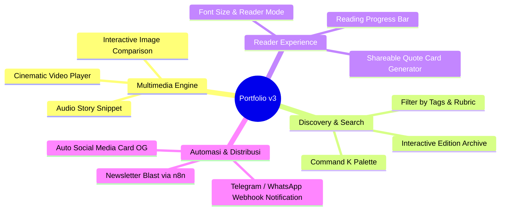

# 🚀 Roadmap & Rekomendasi Fitur Portfolio Web v3 (Next Evolution)

Dokumen ini merangkum peta jalan strategis dan ide fitur masa depan untuk pengembangan **Portfolio & Personal Space v3 (itsdvvn.my.id)**.

---

## 🎯 Visi & Arah Pengembangan v3
Setelah fondasi penerbitan artikel, majalah mingguan, CMS terstruktur ala Notion, dan zero-spike fast deployment (v2) selesai dengan sukses, **v3 difokuskan pada 4 pilar utama**:
1. **Interactive Multimedia & Storytelling Engine** (Memaksimalkan identitas sebagai Multimedia Creator & Video Director).
2. **Reader Engagement & Micro-Interactions** (Meningkatkan pengalaman pembaca dan interaksi personal).
3. **Advanced Content Discovery & Global Search** (Mempermudah eksplorasi arsip artikel, edisi majalah, dan tools).
4. **Newsletter & Automation Distribution** (Membawa konten langsung ke inbox pembaca dengan n8n & PocketBase).

---

## 💡 Rencana Fitur Unggulan v3

---

### 1. 🎬 Cinematic Video & Multimedia Storytelling Component
Sebagai seorang *Video Director* dan *Visual Storyteller*, artikel dan portofolio perlu mendukung format presentasi multimedia yang mendalam:
- **Custom Video Embed & Ambient Backdrop**: Embed video (YouTube/Direct MP4/HLS) dengan efek *ambient glow* dan *cinematic widescreen mode*.
- **Before-After Slider**: Komponen geser interaktif untuk membandingkan grading warna video (Color Grading LOG vs Rec.709) atau foto retouching.
- **Audio Snippets / Podcast Player**: Pemutar suara minimalis untuk artikel yang memiliki narasi suara atau rekaman wawancara.

---

### 2. ⚡ Command-K Global Search & Quick Navigation
Membantu pengunjung dan perekrut menjelajahi seluruh artikel, edisi majalah, karya (ships), dan pemikiran (thoughts) secara instan:
- **Instant Search Dialog (Cmd + K)**: Popup pencarian kilat dengan penyorotan teks (*highlighted query*).
- **Deep Filter by Tags & Rubrik**: Halaman arsip artikel dengan multi-filter kategori (misal: *Filosofi*, *Teknologi*, *Seni*).

---

### 3. 📖 Reader Experience & Shareable Quote Generator
Meningkatkan retensi dan keterlibatan pembaca artikel panjang:
- **Reading Progress Bar**: Garis indikator progres membaca halus di bagian atas layar.
- **Highlight & Share Quote Generator**: Pembaca dapat memblok kalimat menarik di dalam artikel dan langsung mengunduh/membagikannya sebagai gambar kartu kutipan estetik ke Instagram Story / Twitter (X).
- **Estimated Reading Time & Table of Contents (TOC) Sticky**: Daftar isi otomatis yang bergerak dinamis saat pembaca scroll artikel.

---

### 4. 📬 Automated Newsletter & Notification System (via n8n VPS)
Memanfaatkan instance **n8n** dan **PocketBase** yang sudah aktif berjalan di VPS:
- **Automated Sunday Newsletter**: Begitu Edisi Majalah Mingguan rilis pada jam yang dijadwalkan, n8n otomatis merangkum edisi tersebut dan mengirimkannya ke email subscribers.
- **Auto Social Media Broadcast**: Webhook n8n yang otomatis memposting pengumuman artikel baru ke kanal Telegram / Discord komunitas.

---

### 5. 🖼️ Dynamic Auto-Generated Open Graph (OG) Images
- Menghasilkan gambar thumbnail share WhatsApp, Twitter, dan LinkedIn secara dinamis dan otomatis menggunakan `@vercel/og` / `satori` di Astro.
- Setiap artikel, edisi majalah, dan thought akan memiliki kartu preview khusus lengkap dengan judul, rubrik, dan tanggal tanpa perlu didesain manual di Photoshop/Canva.

---

## 🗓️ Usulan Prioritas Pengerjaan (Phased Rollout)

| Fase | Fitur | Perkiraan Kompleksitas | Dampak Pengguna |
| :--- | :--- | :--- | :--- |
| **Fase 1** | Dynamic OG Images & Reading Progress Bar | Rendah | 🌟🌟🌟🌟 Tinggi (SEO & Social Sharing) |
| **Fase 2** | Command + K Global Search & Tag Filtering | Sedang | 🌟🌟🌟🌟🌟 Sangat Tinggi (Navigasi) |
| **Fase 3** | Multimedia Components (Video/Audio/Slider) | Sedang | 🌟🌟🌟🌟🌟 Sangat Tinggi (Portofolio) |
| **Fase 4** | n8n Automated Newsletter & Subscriptions | Sedang - Lanjutan | 🌟🌟🌟🌟 Retensi Pembaca |

---

*Dokumen roadmap ini disimpan di [`ROADMAP-V3.md`](file:///Users/yudhi/Documents/yudi-portofolio-web/ROADMAP-V3.md).*
